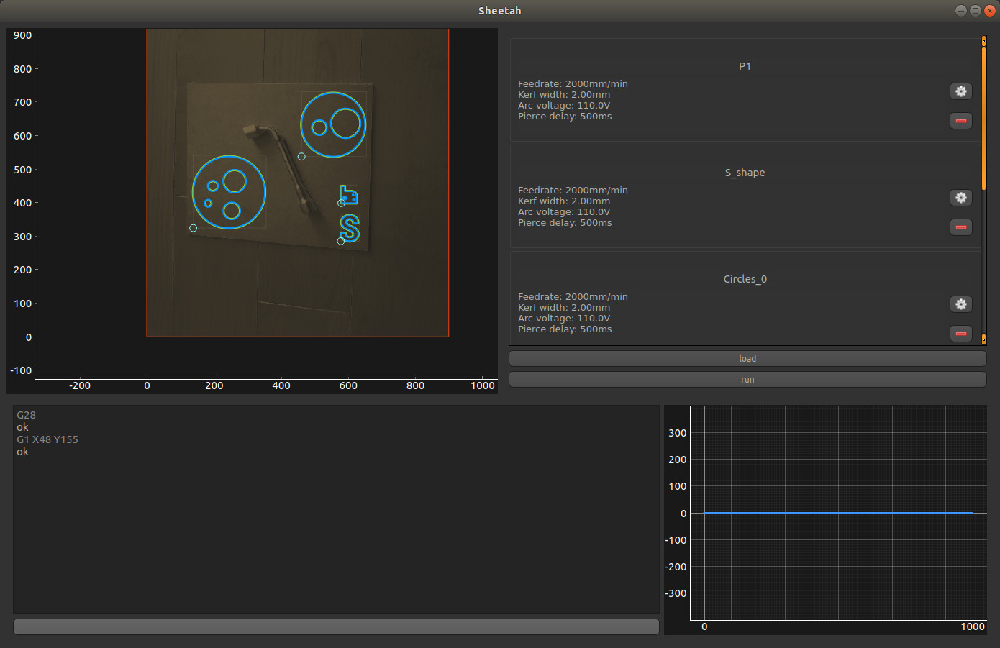

# Sheetah : Augmented reality plasma CAM software

Sheetah is part of the OpenPlasma project. It has been designed to work on top of [Klipper-plasma](https://github.com/proto3/klipper-plasma), a [Klipper](https://github.com/KevinOConnor/klipper) fork that brings specific gcodes and THC.

[Documentation here](https://openplasma.readthedocs.io) (work in progress...)

