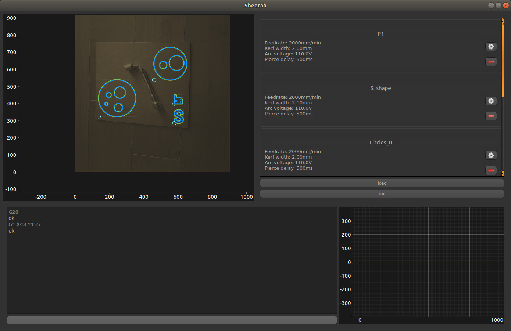

***Work in progress...***
# Sheetah : Plasma CAM software

Sheetah is a CAM software for plasma. It has been designed to work in pair with the plasma version of [Klipper](https://github.com/proto3/klipper-plasma). Combining both softwares unlock THC real-time monitoring and dynamic error handling instead of a static G-code file.
Work is still in progress and any help is welcome !

You can read [documentation here](https://sheetah.readthedocs.io), or have a look at [Klipper for plasma](https://github.com/proto3/Sheetah).

## Augmented reality machining
It is planned to add augmented reality to Sheetah through a webcam fixed above the machine and some calibration algorithms. This way, it would be easier to fit parts in metal scraps onto the machine.

